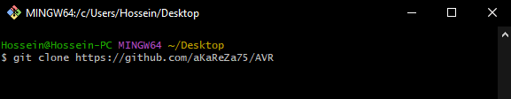
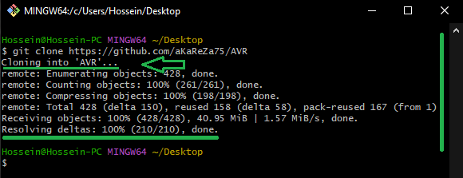
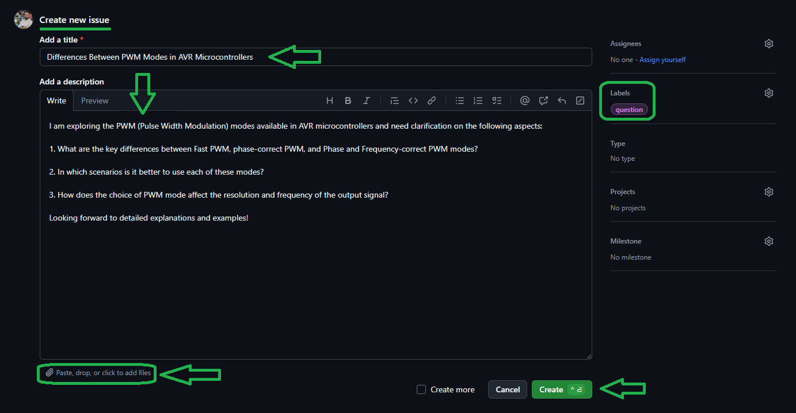

# AVR
[](https://www.youtube.com/playlist?list=PLDdvbHxhit_X3Aj13pAqfhCX3Dn080p6r)
[](https://www.youtube.com/playlist?list=PLDdvbHxhit_Wx2JMPtw0zOPWzKg26iM7O)

MicroController Fundamental
-------------
[](https://youtu.be/Clsv0KyD4RM)
[](https://youtu.be/vrKq5oZxuT0)
[](https://youtu.be/GfvmpeDFT_o)
[](https://youtu.be/XhBq_QvCxYE)
[](https://youtu.be/WPOZ_3E0mC8)
[](https://youtu.be/_i_MXrbRf7o)
[](https://youtu.be/QGhRRsIICUU)
[](https://youtu.be/kBbZi6WWGiM)
[](https://youtu.be/5B_eDfAgxZU)
[](https://youtu.be/C2yjVLjOY4c)
[](https://youtu.be/zN1l83ps8rc)
[](https://youtu.be/ZmDLpSMhs-I)
[](https://youtu.be/wq8CSptCZ9o)
[](https://youtu.be/Zr2dET7aFKM)
[](https://youtu.be/R8XcFXiZaRU)
[](https://youtu.be/CzTxCzfNQtw)
[](https://youtu.be/jNMS3Ukl_1E)
[](https://youtu.be/PrTcroT5kgM)
[](https://youtu.be/F_oOUHInUFk)

AVR MicroController
-------------
[](https://youtu.be/MzOPimZQYaU)
[](https://youtu.be/fGsOeDv1-gI)
[](https://youtu.be/_0uQSh0qBBo)
[](https://youtu.be/Kn6aQvtuO08)
[](https://youtu.be/xa3nRQx28Nw)
[](https://youtu.be/HGlJtcpjZ-E)
[](https://youtu.be/_pwxBJ06aMk)
[](https://youtu.be/5OG6KQWCLCA)
[](https://youtu.be/eGV7mYVpWX4)
[](https://youtu.be/hNRjyU02NoM)
[](https://youtu.be/J1_z-FngLbA)
[](https://youtu.be/TJEfbymLoTs)
[](https://youtu.be/HWJqS9NjYIA)
[](https://youtu.be/HWJqS9NjYIA)
[](https://youtu.be/SJJGwX5tNis)

| Arduino | ATMega328 | 7Seg  Oled | LCD Keypad |
| :---:   | :---:     |  :---:     |   :---:    |
| A0      | PC0       |  Seg_A     |    Keys    |
| A1      | PC1       |  Seg_B     |     -      |
| A2      | PC2       |  Seg_C     |     -      |
| A3      | PC3       |  Seg_D     |     -      |
| A4      | PC4       |  SDA       |     -      |
| A5      | PC5       |  SCL       |     -      |
| D0      | PD0       |  Seg_E     |     -      |
| D1      | PD1       |  Seg_F     |     -      |
| D2      | PD2       |  SW_1      |     -      |
| D3      | PD3       |  SW_2      |     -      |
| D4      | PD4       |  Seg_G     |  LCD_DB4   |
| D5      | PD5       |  RGB_G     |  LCD_DB5   |
| D6      | PD6       |  RGB_B     |  LCD_DB6   |
| D7      | PD7       |  Seg_DP    |  LCD_DB7   |
| D8      | PB0       |  Digit_1   |  LCD_RS    |
| D9      | PB1       |  Digit_2   |  LCD_EN    |
| D10     | PB2       |  Digit_3   |  LCD_BL    |
| D11     | PB3       |  RGB_R     |     -      |
| D12     | PB4       |  Digit_4   |     -      |
| D13     | PB5       |  SW_3      |     -      |


# 💻 How to Use Git and GitHub

First, open **Git Bash** :
-  Open the folder in **File Explorer** where you want the library to be stored.
-  **Right-click** inside the folder and select the option **"Open Git Bash here"** to open **Git Bash** in that directory.


> Note: If you do not see the "Open Git Bash here" option, it means that Git is not installed on your system.
> 
>  You can download and install Git from [this link](https://git-scm.com/downloads).
>  
>  For a tutorial on how to install and use Git, check out [this video](https://youtu.be/BsykgHpmUt8).
  
-  Once **Git Bash** is open, run the following command to clone the repository:

 ```bash
git clone https://github.com/aKaReZa75/AVR
```
- You can copy the above command by either:
- Clicking on the **Copy** button on the right of the command.
- Or select the command text manually and press **Ctrl + C** to copy.
- To paste the command into your **Git Bash** terminal, use **Shift + Insert**.



- Then, press Enter to start the cloning operation and wait for the success message to appear.



**Note:** Please keep in mind that the numbers displayed in the image might vary when you perform the same actions. This is because repositories are continuously being updated and expanded. Nevertheless, the overall process remains unchanged.

# 📝 How to Ask Questions
If you have any questions or issues, you can raise them through the **"Issues"** section of this repository. Here's how you can do it:  

1. Navigate to the **"Issues"** tab at the top of the repository page.  

  

2. Click on the **"New Issue"** button.  
   
  

3. In the **Title** field, write a short summary of your issue or question.  

4. In the "Description" field, detail your question or issue as thoroughly as possible. You can use text formatting, attach files, and assign the issue to someone if needed. You can also use text formatting (like bullet points or code snippets) for better readability.  

5. Optionally, you can add **labels**, **type**, **projects**, or **milestones** to your issue for better categorization.  

6. Click on the **"Submit new issue"** button to post your question or issue.
   
  

I will review and respond to your issue as soon as possible. Your participation helps improve the repository for everyone!  

**Tips**:  
- Before creating a new issue, please check the **"Closed"** section to see if your question has already been answered.  
     
- Write your question clearly and respectfully to ensure a faster and better response.  
- While the examples provided above are in English, feel free to ask your questions in **Persian (فارسی)** as well. There is no difference in how they will be handled!  

**Note:** Pages and interfaces may change over time, but the steps to create an issue generally remain the same.  

# 🤝 Contributing to the Repository
To contribute to this repository, please follow these steps:
1. **Fork the Repository**  
2. **Clone the Forked Repository**  
3. **Create a New Branch**  
4. **Make Your Changes**  
5. **Commit Your Changes**  
6. **Push Your Changes to Your Forked Repository**  
7. **Submit a Pull Request (PR)**  

Please ensure your pull request includes a clear description of the changes you’ve made. Once submitted, I will review your contribution and provide feedback if necessary.

# 🌟 Support Me
If you found this repository useful:
- Subscribe to my [YouTube Channel](https://www.youtube.com/@aKaReZa75).
- Share this repository with others.
- Give this repository and my other repositories a star.
- Follow my [GitHub account](https://github.com/aKaReZa75).

# 📜 License
This project is licensed under the GPL-3.0 License. This license grants you the freedom to use, modify, and distribute the project as long as you:
- Credit the original authors: Give proper attribution to the original creators.
- Disclose source code: If you distribute a modified version, you must make the source code available under the same GPL license.
- Maintain the same license: When you distribute derivative works, they must be licensed under the GPL-3.0 too.
- Feel free to use it in your projects, but make sure to comply with the terms of this license.
  
# ✉️ Contact Me
Feel free to reach out to me through any of the following platforms:
- 📧 [Email: aKaReZa75@gmail.com](mailto:aKaReZa75@gmail.com)
- 🎥 [YouTube: @aKaReZa75](https://www.youtube.com/@aKaReZa75)
- 💼 [LinkedIn: @akareza75](https://www.linkedin.com/in/akareza75)
