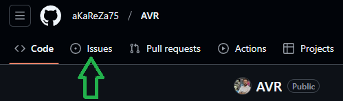

# ATmega328 AVR Microcontroller

The ATmega328 is a low-power, 8-bit microcontroller based on the AVR-enhanced RISC architecture.   
It is one of the most popular microcontrollers in the AVR family, widely used in various embedded systems and DIY projects, including Arduino boards.

## Key Features
- **Architecture**: 8-bit AVR RISC architecture.
- **Flash Memory**: 32 KB of in-system self-programmable flash memory.
- **SRAM**: 2 KB of static RAM.
- **EEPROM**: 1 KB of electrically erasable programmable read-only memory.
- **Clock Speed**: Up to 20 MHz.
- **I/O Pins**: 23 programmable I/O lines.
- **Communication Interfaces**:
  - **USART**: Universal Synchronous/Asynchronous Receiver/Transmitter.
  - **SPI**: Serial Peripheral Interface.
  - **I2C**: Two-wire Serial Interface.
- **Timers/Counters**: Three flexible timers/counters with compare modes.
- **PWM Channels**: Six PWM channels.
- **ADC**: 10-bit Analog-to-Digital Converter with 6 channels.
- **Power Consumption**: Low power consumption with multiple sleep modes.
- **Operating Voltage**: 1.8V to 5.5V.

## Capabilities
- **High Performance**: Executes powerful instructions in a single clock cycle, achieving throughputs approaching 1 MIPS per MHz.
- **Flexibility**: Suitable for a wide range of applications, from simple control systems to more complex embedded systems.
- **Robust Peripherals**: Integrated peripherals like timers, PWM, and ADC make it versatile for various tasks.
- **Ease of Use**: Extensive development tools and libraries are available, making it beginner-friendly.
- **Community Support**: Large community and extensive documentation available.

## Applications
- **Embedded Systems**: Used in various embedded applications due to its robustness and flexibility.
- **DIY Projects**: Popular in DIY electronics and hobbyist projects.
- **Automotive**: Utilized in automotive control systems.
- **Industrial Control**: Suitable for industrial control applications.
- **Consumer Electronics**: Found in various consumer electronic devices.

## Development Tools
- **IDEs**: VScode, PlatformIO.
- **Programmers**: USBasp, AVR MKII, TNM.
- **Debuggers**: None.


# 💻 How to Use Git and GitHub
To access the repository files and save them on your computer, there are two methods available:
1. **Using Git Bash and Cloning the Repository**
   - This method is more suitable for advanced users and those familiar with command-line tools.
   - By using this method, you can easily receive updates for the repository.

2. **Downloading the Repository as a ZIP file**
   - This method is simpler and suitable for users who are not comfortable with command-line tools.
   - Note that with this method, you will not automatically receive updates for the repository and will need to manually download any new updates.

## Clone using the URL.
First, open **Git Bash** :
-  Open the folder in **File Explorer** where you want the library to be stored.
-  **Right-click** inside the folder and select the option **"Open Git Bash here"** to open **Git Bash** in that directory.


> [!NOTE] 
> If you do not see the "Open Git Bash here" option, it means that Git is not installed on your system.  
> You can download and install Git from [this link](https://git-scm.com/downloads).  
> For a tutorial on how to install and use Git, check out [this video](https://youtu.be/BsykgHpmUt8).
  
-  Once **Git Bash** is open, run the following command to clone the repository:
 ```bash
git clone https://github.com/aKaReZa75/AVR
```
- You can copy the above command by either:
- Clicking on the **Copy** button on the right of the command.
- Or select the command text manually and press **Ctrl + C** to copy.
- To paste the command into your **Git Bash** terminal, use **Shift + Insert**.


- Then, press Enter to start the cloning operation and wait for the success message to appear.


> [!IMPORTANT]
> Please keep in mind that the numbers displayed in the image might vary when you perform the same actions.  
> This is because repositories are continuously being updated and expanded. Nevertheless, the overall process remains unchanged.

> [!NOTE]
> Advantage of Cloning the Repository:  
> - **Receiving Updates:** By cloning the repository, you can easily and automatically receive new updates.  
> - **Version Control:** Using Git allows you to track changes and revert to previous versions.  
> - **Team Collaboration:** If you are working on a project with a team, you can easily sync changes from team members and collaborate more efficiently.  

## Download Zip
If you prefer not to use Git Bash or the command line, you can download the repository directly from GitHub as a ZIP file.  
Follow these steps:  
1. Navigate to the GitHub repository page and Locate the Code button:
- On the main page of the repository, you will see a green Code button near the top right corner.

2. Download the repository:
- Click the Code button to open a dropdown menu.
- Select Download ZIP from the menu.

    

3. Save the ZIP file:
- Choose a location on your computer to save the ZIP file and click Save.

4. Extract the ZIP file:
- Navigate to the folder where you saved the ZIP file.
- Right-click on the ZIP file and select Extract All... (Windows) or use your preferred extraction tool.
- Choose a destination folder and extract the contents.

5. Access the repository:
- Once extracted, you can access the repository files in the destination folder.

> [!IMPORTANT]
> - No Updates: Keep in mind that downloading the repository as a ZIP file does not allow you to receive updates.    
>   If the repository is updated, you will need to download it again manually.  
> - Ease of Use: This method is simpler and suitable for users who are not comfortable with Git or command-line tools.

# 📝 How to Ask Questions
If you have any questions or issues, you can raise them through the **"Issues"** section of this repository. Here's how you can do it:  

1. Navigate to the **"Issues"** tab at the top of the repository page.  

  

2. Click on the **"New Issue"** button.  
   
  

3. In the **Title** field, write a short summary of your issue or question.  

4. In the "Description" field, detail your question or issue as thoroughly as possible. You can use text formatting, attach files, and assign the issue to someone if needed. You can also use text formatting (like bullet points or code snippets) for better readability.  

5. Optionally, you can add **labels**, **type**, **projects**, or **milestones** to your issue for better categorization.  

6. Click on the **"Submit new issue"** button to post your question or issue.
   
  

I will review and respond to your issue as soon as possible. Your participation helps improve the repository for everyone!  

> [!TIP]
> - Before creating a new issue, please check the **"Closed"** section to see if your question has already been answered.  
>     
> - Write your question clearly and respectfully to ensure a faster and better response.  
> - While the examples provided above are in English, feel free to ask your questions in **Persian (فارسی)** as well.  
> - There is no difference in how they will be handled!  

> [!NOTE]
> Pages and interfaces may change over time, but the steps to create an issue generally remain the same.

# 🤝 Contributing to the Repository
To contribute to this repository, please follow these steps:
1. **Fork the Repository**  
2. **Clone the Forked Repository**  
3. **Create a New Branch**  
4. **Make Your Changes**  
5. **Commit Your Changes**  
6. **Push Your Changes to Your Forked Repository**  
7. **Submit a Pull Request (PR)**  

> [!NOTE]
> Please ensure your pull request includes a clear description of the changes you’ve made.
> Once submitted, I will review your contribution and provide feedback if necessary.

# 🌟 Support Me
If you found this repository useful:
- Subscribe to my [YouTube Channel](https://www.youtube.com/@aKaReZa75).
- Share this repository with others.
- Give this repository and my other repositories a star.
- Follow my [GitHub account](https://github.com/aKaReZa75).

# 📜 License
This project is licensed under the GPL-3.0 License. This license grants you the freedom to use, modify, and distribute the project as long as you:
- Credit the original authors: Give proper attribution to the original creators.
- Disclose source code: If you distribute a modified version, you must make the source code available under the same GPL license.
- Maintain the same license: When you distribute derivative works, they must be licensed under the GPL-3.0 too.
- Feel free to use it in your projects, but make sure to comply with the terms of this license.
  
# ✉️ Contact Me
Feel free to reach out to me through any of the following platforms:
- 📧 [Email: aKaReZa75@gmail.com](mailto:aKaReZa75@gmail.com)
- 🎥 [YouTube: @aKaReZa75](https://www.youtube.com/@aKaReZa75)
- 💼 [LinkedIn: @akareza75](https://www.linkedin.com/in/akareza75)
