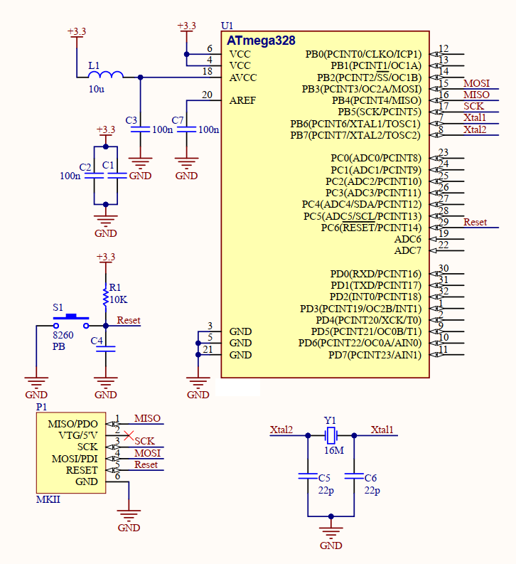

# ATmega328 Minimum Hardware
This document provides an overview of the minimum hardware components and connections required to successfully set up and operate an **ATmega328** microcontroller.

## 1. **Power Supply**
   - **VCC:** Connect to 3.3V.
   - **GND:** Connect to ground.
   - **AVCC:** Connect to 3.3V.
        - Optional: To eliminate noise, use an LC filter with a 10µH inductor and a 100nF capacitor.
   - **AREF:** Connect a 0.1µF capacitor to GND.
   - **Decoupling Capacitors:** add 0.1µF near VCC pins to reduce noise.
   
## 2. **Reset Circuit**
   - **Pull-up Resistor:** 10kΩ connected to the **RESET** pin
   - Optional **Reset Button:** One side connected to RESET pin, the other side to GND
   - Optional: Connect a 100nF capacitor between the RESET pin and GND to reduce bounce noise when pressing the reset button.
   
## 3. **Oscillator Circuit**
   - **Crystal Oscillator:** 16MHz (or internal 8MHz oscillator if high precision is not required)
   - Connect the 16MHz crystal between **XTAL1** (pin 9) and **XTAL2** (pin 10).
   - **Capacitors:**  Place 22pF capacitors between each pin of the crystal and GND.
   
## 4. **Programming Interface**
   - **ISP Programmer** (e.g., USBasp or MKII or TNM).
   - Connections:
     - MISO, MOSI, SCK, RESET, VCC, and GND pins for ISP.

## 5. **Minimal Schematic**
Here is a simplified schematic for stable **ATMEGA328** operation:

# 🌟 Support Me
If you found this repository useful:
- Subscribe to my [YouTube Channel](https://www.youtube.com/@aKaReZa75).
- Share this repository with others.
- Give this repository and my other repositories a star.
- Follow my [GitHub account](https://github.com/aKaReZa75).
  
# ✉️ Contact Me
Feel free to reach out to me through any of the following platforms:
- 📧 [Email: aKaReZa75@gmail.com](mailto:aKaReZa75@gmail.com)
- 🎥 [YouTube: @aKaReZa75](https://www.youtube.com/@aKaReZa75)
- 💼 [LinkedIn: @akareza75](https://www.linkedin.com/in/akareza75)